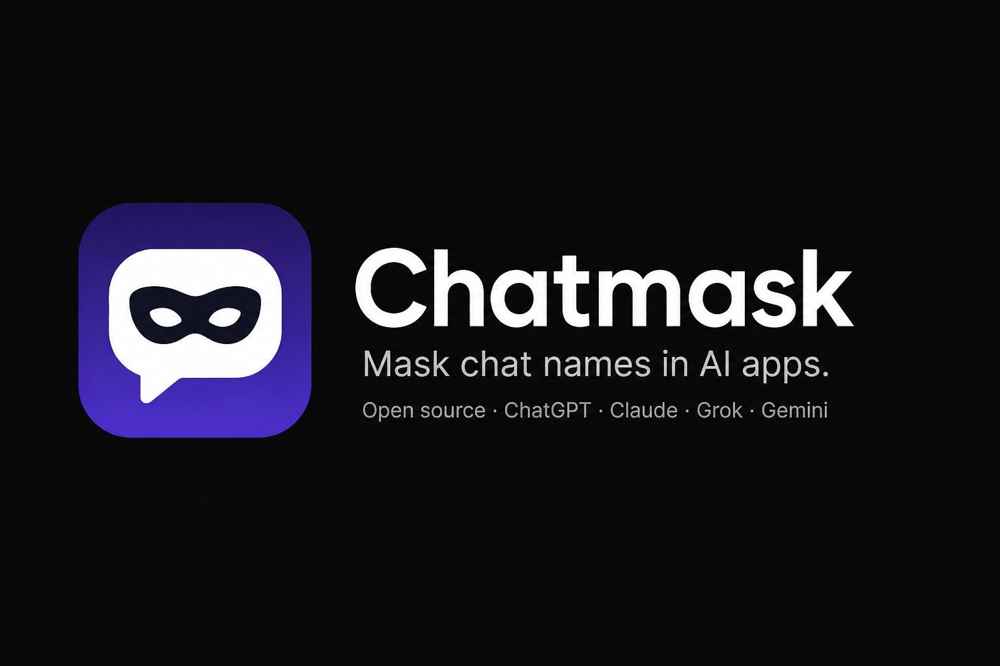

<p align="center">
  
</p>

<p align="center">
  <strong>Mask sidebar chat names in ChatGPT, Claude, Grok, and Gemini.</strong><br />
  Local. Open source. Off until you turn it on.
</p>

<p align="center">
  <a href="LICENSE"></a>
  <a href="https://github.com/shreyas-sreedhar/chatmask"></a>
  
</p>

Chatmask is a Chrome extension for when someone can see your screen. It replaces **sidebar conversation titles** with similar-length gibberish so Recents don’t leak what you were talking about. Messages, the main thread, search, and your profile are left alone.

Nothing is uploaded. There is no account and no server. The only permission is `storage`, so the on/off switch and app checkboxes persist on your machine.

## Features

- Works on [ChatGPT](https://chatgpt.com), [Claude](https://claude.ai), [Grok](https://grok.com), and [Gemini](https://gemini.google.com)
- Masks Recents / history rows only — not the open chat, tab title, or nav labels
- Same conversation always gets the same fake name (stable per chat id)
- Spaces and punctuation stay put, so the list still looks like a list
- Per-app checkboxes; only selected apps are masked
- Stays on across tabs and reloads until you turn it off
- Completely local — chat text never leaves the page

## Install

### From source (unpacked)

1. Clone this repo:

   ```bash
   git clone https://github.com/shreyas-sreedhar/chatmask.git
   cd chatmask
   ```

2. Open Chrome → `chrome://extensions`
3. Turn on **Developer mode**
4. Click **Load unpacked** and select this folder
5. Pin Chatmask from the puzzle menu if you want the icon always visible

After you reload the extension, refresh any open chat tab once so the new script is injected.

## Use

1. Open ChatGPT, Claude, Grok, or Gemini with the sidebar visible
2. Click the Chatmask icon and turn the switch **Active**
3. Sidebar titles become gibberish; rows stay clickable
4. Uncheck an app to skip masking on that site
5. Turn the switch **Inactive** to restore real titles
6. Refresh the chat page if names don’t update

## Privacy

Full policy: [PRIVACY.md](PRIVACY.md)

Chatmask does not collect, transmit, or sell data.

| | |
| --- | --- |
| Network | None. No analytics, accounts, or remote config. |
| Permissions | `storage` only — remembers the toggle and which apps you selected. |
| Chat content | Never read for anything except the **sidebar title** of Recents rows. Message bodies are not touched. |
| Servers | There are none. |

If you fork or redistribute this project, keep it that way.

| | |
| --- | --- |
| Network | None. No analytics, accounts, or remote config. |
| Permissions | `storage` only — remembers the toggle and which apps you selected. |
| Chat content | Never read for anything except the **sidebar title** of Recents rows. Message bodies are not touched. |
| Servers | There are none. |

If you fork or redistribute this project, keep it that way.

## How it works

Each site has a small adapter under `src/sites/` that finds Recents links by stable attributes (`href`, `data-*`, `data-test-id`) rather than hashed CSS classes.

When masking is on, Chatmask:

1. Derives a seed from the conversation id
2. Rewrites the title to deterministic gibberish of similar length
3. Watches the sidebar so new and virtualized rows stay covered

Turn it off and the original titles are restored from attributes stored on the nodes. State lives in `chrome.storage.local`.

## Project layout

```
manifest.json       Chrome MV3 manifest
popup.html          Toolbar popup
src/content.js      Cover / restore + observers
src/gibberish.js    Seeded fake titles
src/sites/          ChatGPT, Claude, Grok, Gemini adapters
background.js       Keeps storage events reaching open tabs
icons/              Toolbar and store icons
```

## Contributing

Issues and pull requests are welcome.

Useful changes:

- New site adapters that only target Recents rows
- Selector fixes when a provider ships a sidebar redesign
- Accessibility and popup copy

Please don’t add network calls, accounts, or extra permissions unless there is a very strong reason. This project’s promise is that it stays local.

## License

[MIT](LICENSE) © 2026 Shreyas Sreedhar
